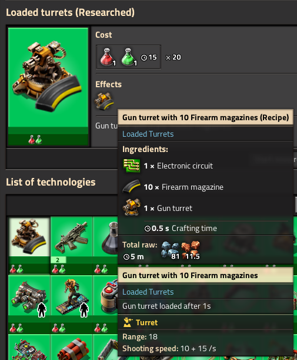
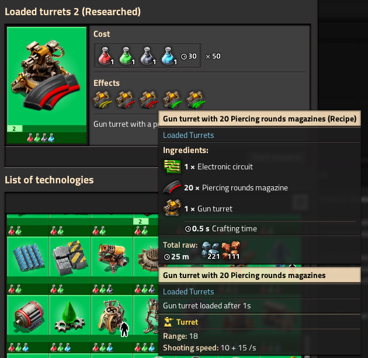
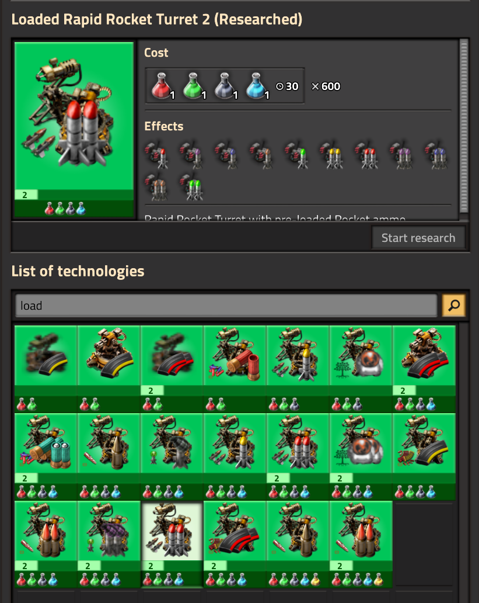
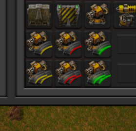
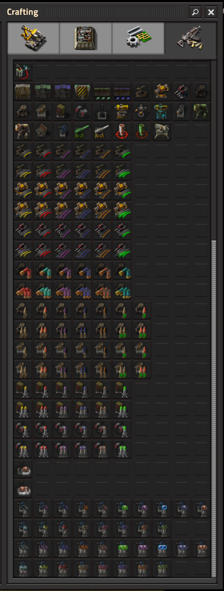

*Loaded Turrets* adds recipes to craft ammo-based turrets with pre-filled ammo of your choice. This makes it easier to perform turret creep, requiring less microing to assault enemy bases.

> As of version 1.0.0, *Loaded Turrets* attempts to support all ammo-based turrets and ammo added by any loaded mod. Artillery and fluid turrets and derivatives are not yet supported. If you encounter any issues with a particular mod please open a discussion or ping me on discord!

Loaded turrets act the same as normal ammo turrets, and when mined the result is a normal turret which is ready to be crafted into a loaded turret again. This means you can use pick item on them (Q), blueprint them, and place them with bots.

But watch out! Loaded turrets have some tradeoffs:

Ammo is added ***1 second*** after the turret is placed. (Adjustable with mod setting.)

The recipe crafts quickly (0.5s) but ***consumes an electronic circuit***. (Think of it like you're jerry-rigging the brains of an inserter into the turret.) Make sure you bring enough circuits with you if you want to re-load your turrets a lot.

## Gallery

